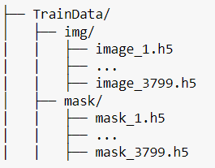
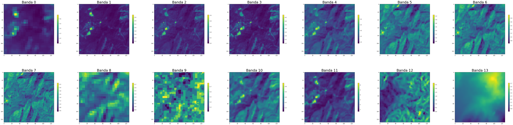
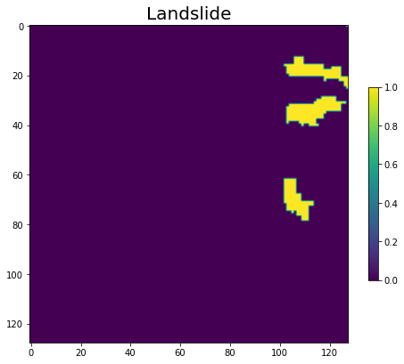

# Identificación de desliamientos en imágenes Sentinel-2

Esta página explica el trabajo desarrollado en el marco del *Capstone project* del Postgrado UB Datascience and Machine Learning (  http://www.ub.edu/datascience/postgraduate/ ) por los estudiantes:
- Lluis Serra Domínguez
- Jesús de Diego Alarcón

Como tema para el projecto final se ha utilizado el *challenge* propuesto por el *Institute for Advanced Research in Artificial Ingelligente* accesible en el siguiente enlace: [Landslide4Sense](https://www.iarai.ac.at/landslide4sense/)

El repositorio con el código desarrollado en el marco del proyecto puede encontrarse aquí: [Repositorio](https://github.com/SERRA17/landslide-susceptibility)

## Introducción

Un deslizamiento es un tipo de corrimiento o movimiento en la masa de la tierra, provocado por la inestabilidad de un talud o ladera. Se produce cuando una gran masa de terreno se convierte en zona inestable y se desliza con respecto a una zona estable, a través de una superficie o franja de terreno de pequeño espesor. Los deslizamientos se producen cuando en la franja se alcanza la tensión tangencial máxima en todos sus puntos[^1].


*Esquema de un deslizamiento*

Entre los años 1998 y 2017 los deslizamientos causaron más de 18.000 muertes afectando a más de 4,8 millones de personas[^2]. 


*Imagen del deslizamiento ocurrido en Arnedo, Colombia, en 1985*

La identificación de deslizamientos pasados es vital para la evaluación del riesgo de ocurrencia futura de este tipo de eventos catastróficos. En los últimos años, diversos algorítmos basados en técnicas de Machine Learning aplicadas a imágenes de satélite[^3].


*Identificación de un deslizamiento en una imagen de satélite mediante técnicas de Machine Learning*

## El juego de datos de entrenamiento

El juego de datos con el que se ha realizado el presente trabajo está compuesto por 7598 ficheros \*.h5 repartidos en dos carpetas, "img" y "mask".



En la carpeta "img", cada fichero \*.h5 incluye 12 bandas de una imagen de los satélites Sentinel-2 más dos bandas adicionales: un modelo digital del terreno y un modelo de pendientes. 


*Las 14 bandas en el fichero imgage_1.h5*

Por cada fichero en la carpeta "img", con la misma numeración, y en la carpeta mask, se encuentra el fichero con las etiquetas, identificando las áreas con/sin deslizamiento.



*Deslizamientos etiquetados en el mismo área de la imagen anterior, image_1.h5*


You can use the [editor on GitHub](https://github.com/SERRA17/landslide-susceptibility/edit/gh-pages/index.md) to maintain and preview the content for your website in Markdown files.

Whenever you commit to this repository, GitHub Pages will run [Jekyll](https://jekyllrb.com/) to rebuild the pages in your site, from the content in your Markdown files.

### Markdown

Markdown is a lightweight and easy-to-use syntax for styling your writing. It includes conventions for

```markdown
Syntax highlighted code block

# Header 1
## Header 2
### Header 3

- Bulleted
- List

1. Numbered
2. List

**Bold** and _Italic_ and `Code` text

[Link](url) and 
```

For more details see [Basic writing and formatting syntax](https://docs.github.com/en/github/writing-on-github/getting-started-with-writing-and-formatting-on-github/basic-writing-and-formatting-syntax).

### Jekyll Themes

Your Pages site will use the layout and styles from the Jekyll theme you have selected in your [repository settings](https://github.com/SERRA17/landslide-susceptibility/settings/pages). The name of this theme is saved in the Jekyll `_config.yml` configuration file.

### Support or Contact

Having trouble with Pages? Check out our [documentation](https://docs.github.com/categories/github-pages-basics/) or [contact support](https://support.github.com/contact) and we’ll help you sort it out.

[^1]: Modificado de https://es.wikipedia.org/wiki/Deslizamiento_de_tierra
[^2]: Fuente: https://www.who.int/health-topics/landslides#tab=tab_1 
[^3]: Ver, por ejemplo, https://link.springer.com/article/10.1007/s11069-022-05423-7 
