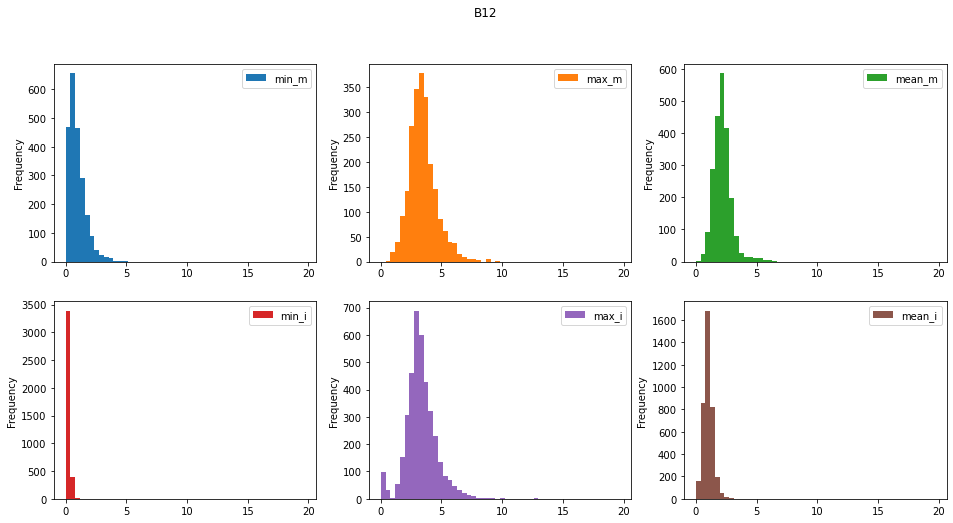
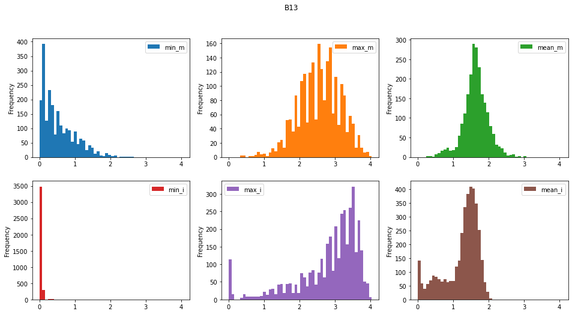
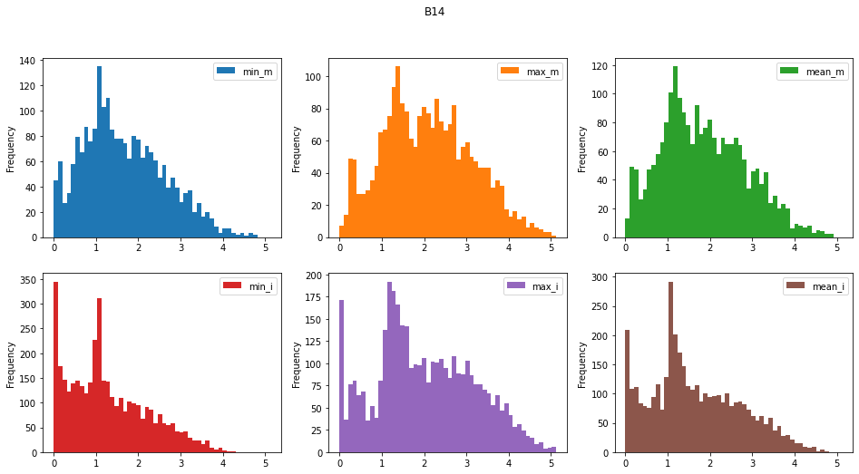
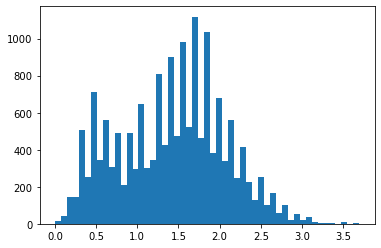
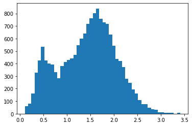

# Identificación de desliamientos en imágenes Sentinel-2

Esta página explica el trabajo desarrollado en el marco del *Capstone project* del Postgrado UB Datascience and Machine Learning (  http://www.ub.edu/datascience/postgraduate/ ) por los estudiantes:
- Lluis Serra Domínguez
- Jesús de Diego Alarcón

Como tema para el projecto final se ha utilizado el *challenge* propuesto por el *Institute for Advanced Research in Artificial Ingelligente* accesible en el siguiente enlace: [Landslide4Sense](https://www.iarai.ac.at/landslide4sense/)

El repositorio con el código desarrollado en el marco del proyecto puede encontrarse aquí: [Repositorio](https://github.com/SERRA17/landslide-susceptibility)

## Introducción

Un deslizamiento es un tipo de corrimiento o movimiento en la masa de la tierra, provocado por la inestabilidad de un talud o ladera. Se produce cuando una gran masa de terreno se convierte en zona inestable y se desliza con respecto a una zona estable, a través de una superficie o franja de terreno de pequeño espesor. Los deslizamientos se producen cuando en la franja se alcanza la tensión tangencial máxima en todos sus puntos[^1].


*Esquema de un deslizamiento*

Entre los años 1998 y 2017 los deslizamientos causaron más de 18.000 muertes afectando a más de 4,8 millones de personas[^2]. 


*Imagen del deslizamiento ocurrido en Arnedo, Colombia, en 1985*

La identificación de deslizamientos pasados es vital para la evaluación del riesgo de ocurrencia futura de este tipo de eventos catastróficos. En los últimos años, diversos algorítmos basados en técnicas de Machine Learning aplicadas a imágenes de satélite[^3].


*Identificación de un deslizamiento en una imagen de satélite mediante técnicas de Machine Learning*

## El juego de datos de entrenamiento

El juego de datos con el que se ha realizado el presente trabajo está compuesto por 7598 ficheros \*.h5 repartidos en dos carpetas, "img" y "mask".


En la carpeta "img", cada fichero \*.h5 incluye 12 bandas de una imagen de los satélites Sentinel-2 más dos bandas adicionales: un modelo digital del terreno y un modelo de pendientes:

- Datos multiespectrales de Sentinel-2[^4] : B1, B2, B3, B4, B5, B6, B7, B8, B9, B10, B11, B12.
- Datos de pendiente de ALOS PALSAR[^5] : B13.
- Modelo digital de elevaciones (MDE o DEM) de ALOS PALSAR: B14.

Cada banda presenta 128\*128 píxeles, con una resolución de 10 m por pixel.


*Las 14 bandas en el fichero imagen_1.h5*


Por cada fichero en la carpeta "img", con la misma numeración en el fichero, tamaño de malla (128\*128), resolución (10 m) en la carpeta mask se encuentra el fichero con las etiquetas, identificando las áreas con/sin deslizamiento.


*Deslizamientos etiquetados en la imagen mask_1.h5 (mismo área que la imagen anterior, image_1.h5*)*

Las imágenes etiquetadas ("mask") siguen la siguiente clasificación:
- No deslizamiento: 0
- Deslizamiento: 1

En la siguiente imagen muestra un primer análisis de la distribución de los valores para las diferentes bandas y en las zonas etiquetas con/sin deslizamiento [Ver aquí en análisis completo](https://github.com/SERRA17/landslide-susceptibility/blob/main/testing%20the%20dataset/Analisis%20de%20im%C3%A1genes.ipynb). 





Para las tres bandas mostradas en la figura (Bandas 12, 13 y 13) se han generado los siguientes histogramas:
```
- min_m . El valor mínimo de la banda en las áreas con deslizamiento
- max_m . El valor máximo de la banda en las áreas con deslizamiento
- mean_m . El valor medio de la banda en las áreas con deslizamiento
- min_i . El valor mínimo de la banda en las áreas sin deslizamiento
- max_i . El valor máximo de la banda en las áreas sin delizamiento
- mean_i . El valor medio de la banda en las áreas con deslizamiento
```

Uno de los elementos que cabe mencionar del gráfico anterior es el caracter "serrado" de los histogramas de pendientes y elevaciones (DEM), bandas 13 y 14. Esto indica una concentración de celdas en torno a unos valores determinados. Aparentemente el modelo de pendientes se ha elaborado a partir del modelo digital de elevaciones (DEM). Esto podría indicar que el DEM se ha interpolado a partir de curvas de nivel (los picos indicarían los valores de las curvas de nivel que son equidistantes en un mapa 2D).

Este hecho es relevante porque nos obligará más adelante a considerar el tratamiento de estas dos bandas (pendiente y modelo digital de elevaciones).

## Preprocesado de los datos

Antes de comenzar a definir los modelos, vamos a explorar varias alternativas para el preprocesado de los datos. Utilizaremos dos aproximaciones:
- Creación de nuevas bandas
- Generación de nuevos indicadores a partir de un DEM (Digial Elevation Model o Modelo Digital de Elevaciones) previamente suavizado. 

### Creación de nuevas bandas

La revisión de la literatura científica[6^] nos indica que existen varios indicadores, generados a partir de las bandas multiespectrales estándar, que pueden ser utilizados con éxito en la identificación de deslizamientos. Nos vamos a centar en dos de estos indicadores:
- NDVI[^7] ( Normalized Difference Vegetation Index o Índice de Vegetación de Diferencia Normalizada) es un índice que estima la densidad de vegetación. Éste índice se calcular mediante la siguiente fórmula: 
```  
NDVI = (NIR-Red) / (NIR+Red) 
donde:
NIR es la banda del infrarrojo cercano
Red es la banda del rojo
En el caso de Sentinel-2 la combinación de bandas para obtener este índice es:
NDVI (Sentinel 2) = (B8 – B4) / (B8 + B4)
```
- BSI o Barren Soil Index es otro índice que se suele utilizar en la identificación de deslizamientos[^8]. Su formulación, para imágenes Sentinel-2, es la siguiente:
```
BSI = ((B11 + B04) - (B08 + B02)) / ((B11 + B04) + (B08 + B02))
```
### Generación de nuevos indicadores a partir del DEM suavizado

Tanto el DEM como la banda de pendientes son, a priori, conjuntos de datos que pueden resultar de interés en la identificación de deslizamientos, debido a las formas características como los escarpes en cabecera o las áreas de acumulación suvazada al pie deslizamiento que podrían verse reflejadas en estas capas. Sin embargo, en las imágenes de entrenamiento (ver las imágenes de los histogramas de las bandas 13 y 14 más arriba) el histograma del modelo digital de elevaciones (DEM o MDE) y de la bande de pendientes nos muestra una agrupación de valores en determinados intervalos (¿quizás las curvas de nivel a partir de las cuales se generaron estos datos?).

Para intentar mejorar estos conjuntos de datos, se ha optado por aplicar un filtro de 5x5 para suavizar tanto el modelo digital de elevaciones como la capa de pendientes.

 
*Histograma de las capas de pendientes sin suavizar - izquierda - y suavizada - derecha - para la imagen imagen_1.h5*


-------------------------------------------------------------------------

### Markdown

Markdown is a lightweight and easy-to-use syntax for styling your writing. It includes conventions for

```markdown
Syntax highlighted code block

# Header 1
## Header 2
### Header 3

- Bulleted
- List

1. Numbered
2. List

**Bold** and _Italic_ and `Code` text

[Link](url) and 
```

For more details see [Basic writing and formatting syntax](https://docs.github.com/en/github/writing-on-github/getting-started-with-writing-and-formatting-on-github/basic-writing-and-formatting-syntax).

### Jekyll Themes

Your Pages site will use the layout and styles from the Jekyll theme you have selected in your [repository settings](https://github.com/SERRA17/landslide-susceptibility/settings/pages). The name of this theme is saved in the Jekyll `_config.yml` configuration file.

### Support or Contact

Having trouble with Pages? Check out our [documentation](https://docs.github.com/categories/github-pages-basics/) or [contact support](https://support.github.com/contact) and we’ll help you sort it out.

[^1]: Modificado de https://es.wikipedia.org/wiki/Deslizamiento_de_tierra
[^2]: Fuente: https://www.who.int/health-topics/landslides#tab=tab_1 
[^3]: Ver, por ejemplo, https://link.springer.com/article/10.1007/s11069-022-05423-7 
[^4]: Más detalles sobre las diferentes bandas en: https://www.satimagingcorp.com/satellite-sensors/other-satellite-sensors/sentinel-2a/ 
[^5]: Más información sobre los datos del proyecto Alos Palsar en https://earth.esa.int/eogateway/catalog/alos-palsar-products
[^6]: Por ejemplo:
https://medium.com/sentinel-hub/landslide-detection-for-rapid-mapping-using-sentinel-2-2a84c2766a0
https://www.ggs-solutions.eu/wp-content/uploads/Landslide-Detection-in-Central-America-using-the-Differential-Bare-Soil-Index.pdf

[^7]: Ver, por ejemplo, https://es.wikipedia.org/wiki/%C3%8Dndice_de_vegetaci%C3%B3n_de_diferencia_normalizada
[^8]: Más información en https://custom-scripts.sentinel-hub.com/custom-scripts/sentinel-2/barren_soil/
