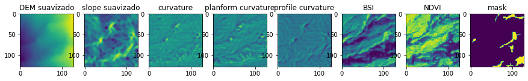
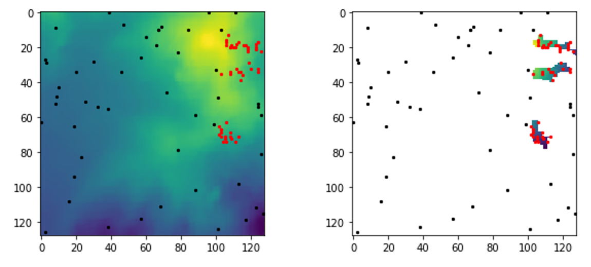
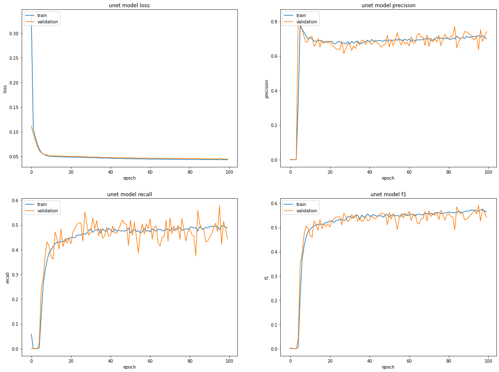
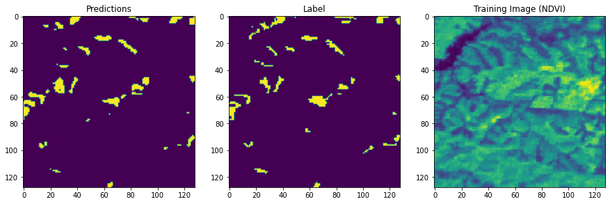

# Identificación de desliamientos en imágenes Sentinel-2

Esta página explica el trabajo desarrollado en el marco del *Capstone project* del Postgrado UB Datascience and Machine Learning (  http://www.ub.edu/datascience/postgraduate/ ) por los estudiantes:
- Lluís Serra Domínguez
- Jesús de Diego Alarcón

Como tema para el projecto final se ha utilizado el *challenge* propuesto por el *Institute for Advanced Research in Artificial Ingelligente* accesible en el siguiente enlace: [Landslide4Sense](https://www.iarai.ac.at/landslide4sense/)

El repositorio con el código desarrollado en el marco del proyecto puede encontrarse aquí: [Repositorio](https://github.com/SERRA17/landslide-susceptibility)

## Introducción

Un deslizamiento es un tipo de corrimiento o movimiento en la masa de la tierra, provocado por la inestabilidad de un talud o ladera. Se produce cuando una gran masa de terreno se convierte en zona inestable y se desliza con respecto a una zona estable, a través de una superficie o franja de terreno de pequeño espesor. Los deslizamientos se producen cuando en la franja se alcanza la tensión tangencial máxima en todos sus puntos[^1].


*Esquema de un deslizamiento*

Entre los años 1998 y 2017 los deslizamientos causaron más de 18.000 muertes afectando a más de 4,8 millones de personas[^2]. 


*Imagen del deslizamiento ocurrido en Arnedo, Colombia, en 1985*

La identificación de deslizamientos pasados es vital para la evaluación del riesgo de ocurrencia futura de este tipo de eventos catastróficos. En los últimos años, diversos algorítmos basados en técnicas de Machine Learning aplicadas a imágenes de satélite[^3].


*Identificación de un deslizamiento en una imagen de satélite mediante técnicas de Machine Learning*

## El juego de datos de entrenamiento

El juego de datos con el que se ha realizado el presente trabajo está compuesto por 7598 ficheros \*.h5 repartidos en dos carpetas, "img" y "mask".


En la carpeta "img", cada fichero \*.h5 incluye 12 bandas de una imagen de los satélites Sentinel-2 más dos bandas adicionales: un modelo digital del terreno y un modelo de pendientes:

- Datos multiespectrales de Sentinel-2[^4] : B1, B2, B3, B4, B5, B6, B7, B8, B9, B10, B11, B12.
- Datos de pendiente de ALOS PALSAR[^5] : B13.
- Modelo digital de elevaciones (MDE o DEM) de ALOS PALSAR: B14.

Cada banda presenta 128\*128 píxeles, con una resolución de 10 m por pixel.


*Las 14 bandas en el fichero imagen_1.h5*


Por cada fichero en la carpeta "img", con la misma numeración en el fichero, tamaño de malla (128\*128), resolución (10 m) en la carpeta mask se encuentra el fichero con las etiquetas, identificando las áreas con/sin deslizamiento.


*Deslizamientos etiquetados en la imagen mask_1.h5 (mismo área que la imagen anterior, image_1.h5)*

Las imágenes etiquetadas ("mask") siguen la siguiente clasificación:
- No deslizamiento: 0
- Deslizamiento: 1

En la siguiente imagen muestra un primer análisis de la distribución de los valores para las diferentes bandas y en las zonas etiquetas con/sin deslizamiento [Ver aquí en análisis completo](https://github.com/SERRA17/landslide-susceptibility/blob/main/testing%20the%20dataset/Analisis%20de%20im%C3%A1genes.ipynb). 


Para las tres bandas mostradas en la figura (Bandas 12, 13 y 13) se han generado los siguientes histogramas:
```
- min_m . El valor mínimo de la banda en las áreas con deslizamiento
- max_m . El valor máximo de la banda en las áreas con deslizamiento
- mean_m . El valor medio de la banda en las áreas con deslizamiento
- min_i . El valor mínimo de la banda en las áreas sin deslizamiento
- max_i . El valor máximo de la banda en las áreas sin delizamiento
- mean_i . El valor medio de la banda en las áreas con deslizamiento
```

Uno de los elementos que cabe mencionar del gráfico anterior es el caracter "serrado" de los histogramas de pendientes y elevaciones (DEM), bandas 13 y 14. Esto indica una concentración de celdas en torno a unos valores determinados. Aparentemente el modelo de pendientes se ha elaborado a partir del modelo digital de elevaciones (DEM). Esto podría indicar que el DEM se ha interpolado a partir de curvas de nivel (los picos indicarían los valores de las curvas de nivel que son equidistantes en un mapa 2D).

Este hecho es relevante porque nos obligará más adelante a considerar el tratamiento de estas dos bandas (pendiente y modelo digital de elevaciones).

## Preprocesado de los datos

Antes de comenzar a definir los modelos, vamos a explorar varias alternativas para el preprocesado de los datos. Utilizaremos dos aproximaciones:
- Creación de nuevas bandas
- Generación de nuevos indicadores a partir de un DEM (Digial Elevation Model o Modelo Digital de Elevaciones) previamente suavizado. 

### Creación de nuevas bandas

La revisión de la literatura científica[6^] nos indica que existen varios indicadores, generados a partir de las bandas multiespectrales estándar, que pueden ser utilizados con éxito en la identificación de deslizamientos. Nos vamos a centar en dos de estos indicadores:
- NDVI[^7] ( Normalized Difference Vegetation Index o Índice de Vegetación de Diferencia Normalizada) es un índice que estima la densidad de vegetación. Éste índice se calcular mediante la siguiente fórmula: 
```  
NDVI = (NIR-Red) / (NIR+Red) 
donde:
NIR es la banda del infrarrojo cercano
Red es la banda del rojo
En el caso de Sentinel-2 la combinación de bandas para obtener este índice es:
NDVI (Sentinel 2) = (B8 – B4) / (B8 + B4)
```
- BSI o Barren Soil Index es otro índice que se suele utilizar en la identificación de deslizamientos[^8]. Su formulación, para imágenes Sentinel-2, es la siguiente:
```
BSI = ((B11 + B04) - (B08 + B02)) / ((B11 + B04) + (B08 + B02))
```

### Generación de nuevos indicadores a partir del DEM suavizado

Tanto el DEM como la banda de pendientes son, a priori, conjuntos de datos que pueden resultar de interés en la identificación de deslizamientos, debido a las formas características como los escarpes en cabecera o las áreas de acumulación suvazada al pie deslizamiento que podrían verse reflejadas en estas capas. Sin embargo, en las imágenes de entrenamiento (ver las imágenes de los histogramas de las bandas 13 y 14 más arriba) el histograma del modelo digital de elevaciones (DEM o MDE) y de la bande de pendientes nos muestra una agrupación de valores en determinados intervalos (¿quizás las curvas de nivel a partir de las cuales se generaron estos datos?).

Para intentar mejorar estos conjuntos de datos, se ha optado por aplicar un filtro de 5x5 para suavizar tanto el modelo digital de elevaciones como la capa de pendientes.

 

*Histograma de frecuencias para los valores de las capas/bandas de pendientes sin suavizar - izquierda - y suavizada - derecha - para la imagen imagen_1.h5*

En el siguiente Notebook se evaluan varios mecanismos para el suavizado de los datos: [DEM and slope denoising.ipynb](https://github.com/SERRA17/landslide-susceptibility/blob/main/testing%20the%20dataset/DEM%20and%20slope%20denoising.ipynb)

Una vez suavizado el modelo digital del terreno, es posible obtener nuevos conjuntos de datos derivados utilizando la librería RichDem[^9] . Los tres nuevos dataset que obtendremos a partir del DEM son[^10] :
- Curvature
- Profile curvature
- Planform curvature

Finalmente, a partir de la información original es posible obtener, para cada imagen, un nuevo conjunto de datasets.



El siguiente fragmento de código permite obtener estos nuevos datos para cada imagen, y es utilizando en este Notebook: [UNET Model](https://github.com/SERRA17/landslide-susceptibility/blob/main/deep-learning/UNET%20model.ipynb)

```
for i, (img, mask) in enumerate(zip(all_train, all_mask)):

    with h5py.File(img) as hdf:
        ls = list(hdf.keys())
        data = np.array(hdf.get('img'))

        # assign 0 for the nan value
        data[np.isnan(data)] = 0.000001
        
        #slope and dem
        dem= data[:, :, 13]
        slope= data[:, :, 12]
        k = 5 #smoothing factor for reducing the noise
        dem_suavizado = cv.blur(dem,(k,k)) #reducción de ruido dem
        slope_suavizado = cv.blur(slope,(k,k)) #reducción de ruido slope
        
        #curvature
        dem_richdem = rd.rdarray(dem_suavizado, no_data=-9999) #convert to rdarray
        dem_curvature = rd.TerrainAttribute(dem_richdem, attrib="curvature") #calculate curvature
        dem_planform_curvature = rd.TerrainAttribute(dem_richdem, attrib="planform_curvature") #calculate planform_curvature
        dem_profile_curvature = rd.TerrainAttribute(dem_richdem, attrib="profile_curvature") #calculate profile curvature
    
        #BSI calculation
        BSI= ((data[:,:,10] + data[:,:,3]) - (data[:,:,7] + data[:,:,1]) / (data[:,:,10] + data[:,:,3]) + (data[:,:,7] + data[:,:,1]))

        # ndvi calculation
        data_red = data[:, :, 3]
        data_nir = data[:, :, 7]
        NDVI = np.divide(data_nir - data_red,np.add(data_nir, data_red))
```
## Análisis de datos
Para el análisis hemos seguido 2 metodologías distantas:
- Modelo de Regresión Logística y Modelo de clasificación Random Forest
- Modelo desegmentación UNET (deep learning)

### Bandas utilizadas
En los modelos que se detallan a continuación se han utilizado 7 bandas para el análisis de datos:
- Modelo Digital de elevación (suavizado)
- Modelo de pendientes (suavizado)
- Modelo de curvatura del terreno
- Modelo de curvatura del terreno (planform curvature)
- Modelo de curvatura del terreno (profile curvature)
- BSI (Índice de Suelo Desnudo)
- NDVI (Índice de Vegetación de Diferencia Normalizada)

### Primer análisis: Modelo logístico y Modelo de clasificación Random Forest
#### Extracción de valores de ráster por puntos
Para implementar el modelo logísto y de Bosques Aleatorios, hemos extraído los valores de las bandas de los rásters en 100 puntos distintos (por fichero). 50 
en zonas de landslide y 50 en zonas sin landslide. De esta manera hemos obtenido una base de datos con las variables respuesta (1, presencia de
deslizamientos; 0, absencia de deslizamientos) y sus pertinentes valores de las bandas en 100 localidades distintas por fichero. El código para la extracción de los valores ráster por puntos se puede encontrar en el siguiente notebook [Raster sampling.ipynb](https://github.com/SERRA17/landslide-susceptibility/blob/main/logistic%20and%20random%20forest%20model/Raster%20sampling.ipynb). La base de datos resultante se puede descargar con el siguiente 
enlace [data_extraction.zip](https://github.com/SERRA17/landslide-susceptibility/blob/main/logistic%20and%20random%20forest%20model/data_extraction.zip). 



*Ejemplo de la disposición de las localidades para el muestreo del ráster para un fichero (en rojo zonas de landslide y en negro zonas sin landslide)*

#### Los modelos
Los [modelos](https://github.com/SERRA17/landslide-susceptibility/blob/main/logistic%20and%20random%20forest%20model/Logistic%20Regression%20and%20Random%20Forest%20classification.ipynb) estan implementados en R.

Antes de crear los modelos, es buena idea hechar un vistazo a los datos: ¿Cuantas variables hay en la base de datos?, ¿Con qué tipo de datos estamos trabajando?, ¿Estan normalizados?, ¿Hay NAs?
También es imprescindible analizar la multicolinearidad entre las variables independientes. Si algunas variables estan correlacionadas, los estimadores obtenidos y la precisión de éstos se verán afectados. Numerosos métodos han sido desarrollados para detectar multicolinealidad. En nuestro modelo hemos usado factor de Inflación de la Varianza (VIF).  Este índice mide hasta qué punto la varianza de un coeficiente de regresión estimado se incrementa a causa de la colinearidad. Generalmente se considera que existe un problema grave cuando el VIF excede 10. 

El modelo de regresión logística utiliza una link function para transformar 

### Segundo análisis: Modelo Secuencial y Modelo U-Net

Se han implementado también dos modelos utilizando técnicas de *deep learning*. En primer lugar se ha creado un modelo secuencial sencillo y a continuación una red convolucional de tipo U-Net. Ambos modelos se han implementado en el siguiente Notebook: [UNET Model](https://github.com/SERRA17/landslide-susceptibility/blob/main/deep-learning/UNET%20model.ipynb)

#### Preprocesado de los datos
Los datos han sido preprocesados para obtener las bandas indicadas anteriormente. Se han suavizado las bandas correspondientes al MDE y a las pendientes. A partir de esta información (en concreto del DEM) se han generado las tres bandas de curvatura del terreno. Además, se han obtenido los índices NDVI y BSI. A continuación, los valores nan generados durante cálculo de los índices NDVI y BSI han sido sustituidos por 0.000001 y se han normalizado las bandas. Todos los datos de las imágenes se han integrado en un array de 4 dimensiones: el índice de la imagen, la fila y columna (128x128) y la banda, siendo las dimensiones finales (3799, 128, 128, 8).

#### El modelo secuencial
En primer lugar, se ha implementado un modelo secuencial con tres capas. 

```
model_sequential.add(Dense(20, input_shape=(128, 128, 7), activation='relu')) 
model_sequential.add(Dense(10, activation='relu'))
model_sequential.add(Dense(1, activation='sigmoid'))
```

Se ha utilizado una función de pérdida de tipo Binary Loss Entropy, atendiendo al caracter binario del resultado esperado. Una vez ejecutado, el modelo ofrece un valor de F1 de  0.5442. En la siguiente imagen se presentan las curvas de aprendizaje de los diferentes parámetros considerados.


*Curvas de aprendizaje del modelo secuencial*

#### El model U-Net

Finalmente se ha implementado un modelo de red convolucional tipo U-Net. Las características del modelo pueden verse en el Notebook [UNET Model](https://github.com/SERRA17/landslide-susceptibility/blob/main/deep-learning/UNET%20model.ipynb) .Se ha utlizado la misma función de pérdida que en el caso anterior. Se programa el modelo para ejecutar 100 epocs. Como resultado final se obtiene un valor de F1 de 0.7006[^11]. Las curvas de aprendizaje de los parámetros se muestran a continuación.


*Curvas de aprendizaje del modelo U-Net*

## Conclusiones

Como principal conclusión podemos indicar que el modelo de red convolucional tipo U-Net implementado permite obtener unos resultados sustancialmente mejores que los otros algoritmos empleados.



En su contra, es muy exigente en el uso de recursos de computación lo que limita las posibilidades de optimización de los parámetros utilizados.


---------------------------------------------------------------------------------------------------------------------------------------------------
[^1]: Modificado de https://es.wikipedia.org/wiki/Deslizamiento_de_tierra
[^2]: Fuente: https://www.who.int/health-topics/landslides#tab=tab_1 
[^3]: Ver, por ejemplo, https://link.springer.com/article/10.1007/s11069-022-05423-7 
[^4]: Más detalles sobre las diferentes bandas en: https://www.satimagingcorp.com/satellite-sensors/other-satellite-sensors/sentinel-2a/ 
[^5]: Más información sobre los datos del proyecto Alos Palsar en https://earth.esa.int/eogateway/catalog/alos-palsar-products
[^6]: Por ejemplo:
https://medium.com/sentinel-hub/landslide-detection-for-rapid-mapping-using-sentinel-2-2a84c2766a0
https://www.ggs-solutions.eu/wp-content/uploads/Landslide-Detection-in-Central-America-using-the-Differential-Bare-Soil-Index.pdf

[^7]: Ver, por ejemplo, https://es.wikipedia.org/wiki/%C3%8Dndice_de_vegetaci%C3%B3n_de_diferencia_normalizada
[^8]: Más información en https://custom-scripts.sentinel-hub.com/custom-scripts/sentinel-2/barren_soil/
[^9]: Ver https://richdem.readthedocs.io/en/latest/ 
[^10]: Para una explicación detallada de estos parámetros: https://richdem.readthedocs.io/en/latest/terrain_attributes.html?highlight=curvature#curvature
[^11]: Como referencia, los equipos ganadores en el *challenge* en el que se basa este trabajo obtuvieron unos valores de F1 entre 0.7454 y 0.7350. El equipo que recibió el premio a la solución más innovadora obtuvo un F1 score de 0.7129.
